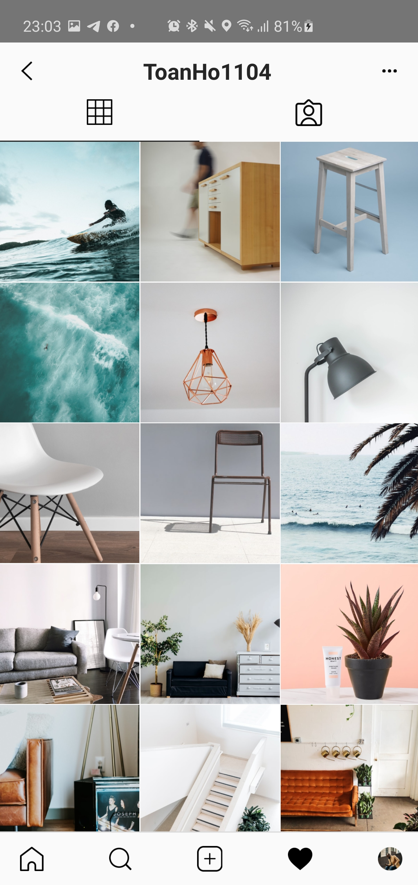
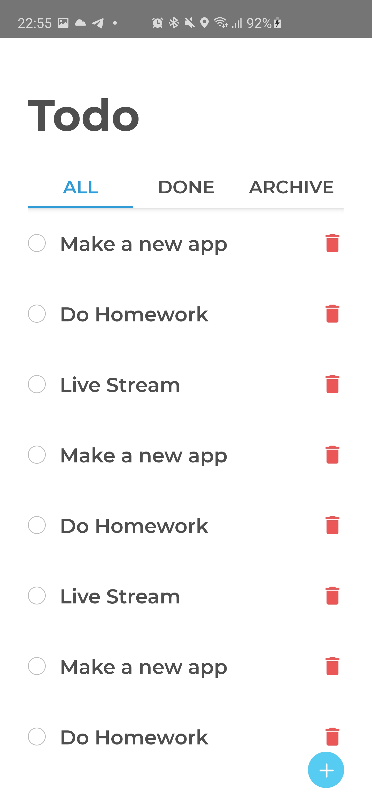

# Tổng Hợp

## Instagram (Thiết kế giao diện theo mẫu)

  
  

 

## Telegram (Thiết kế giao diện theo mẫu)

  
  

 

## Todoredux (làm ví dụ đơn giản về todo redux)

  
  
  

  
  

## Weather (ứng dụng xem thời tiết đơn giản theo thời gian thực)

   
   

## BMI (ứng dụng tính chỉ sô BMI dựa trên cân nặng và chiều cao)

   
   

## ecommerce (ứng dụng bán hàng đơn giản)

  
  
  
  
  
  
  
  

